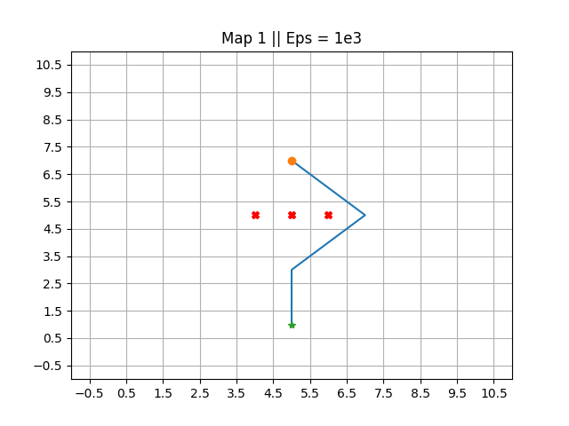
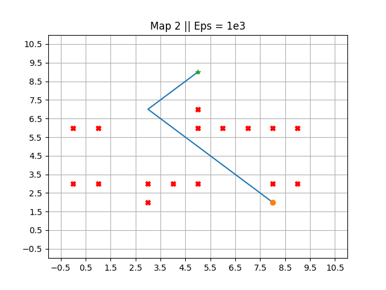
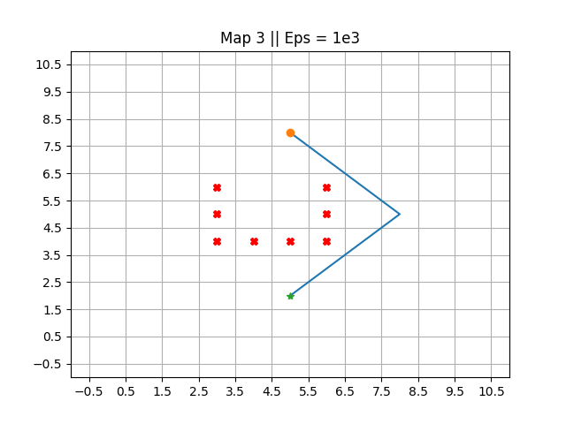

# QAPF explanation

This project aims to develop a new algorithm that overcomes the limitations of traditional Q-reinforcement learning and Artificial Potential Field methods by combining their strengths. The integration of these approaches is expected to enhance the efficiency and effectiveness of autonomous decision-making systems while navigating complex scenarios and learning from past experiences. Throughout the project, the primary focus has been on treating this assignment as a valuable learning opportunity, delving into the challenges of merging different algorithms and methodologies to deepen our understanding of Q-reinforcement learning and Artificial Potential Field techniques. By addressing the limitations of these methods, the goal is to improve the decision-making capabilities of autonomous systems in dynamic environments. This work contributes valuable insights into the development and integration of hybrid algorithms for autonomous systems, paving the way for more advanced and adaptable AI technologies in the future.

In the images below the orange dot represents the robot's starting point and the green star represents the robot's goal. The red Xs represent obstacles.

